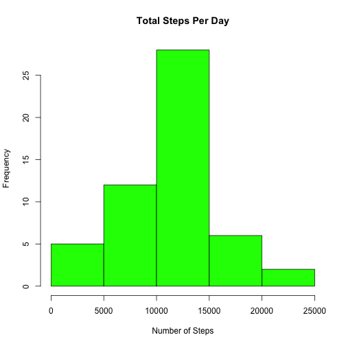
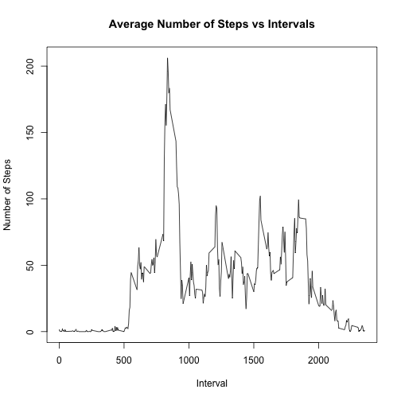
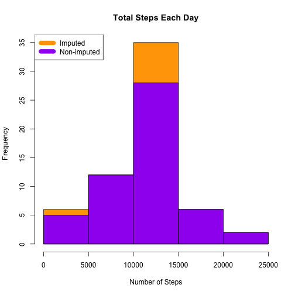
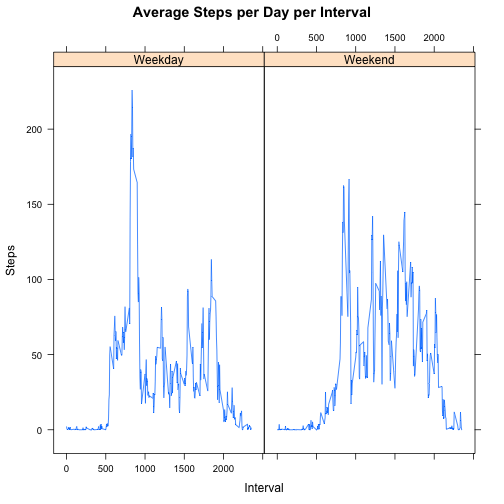

##Loading and preprocessing the data

Show any code that is needed to

Load the data (i.e. 𝚛𝚎𝚊𝚍.𝚌𝚜𝚟())
Process/transform the data (if necessary) into a format suitable for your analysis


The data has been previously downloaded and unzipped
It is in a local directory named Documents/Rcode. 


```r
activity_data <- read.csv("activity.csv")
```


##What is mean total number of steps taken per day?

For this part of the assignment, you can ignore the missing values in the dataset.

Calculate the total number of steps taken per day
If you do not understand the difference between a histogram and a barplot, research the difference between them. Make a histogram of the total number of steps taken each day
Calculate and report the mean and median of the total number of steps taken per day


```r
steps_per_day <- aggregate(steps ~ date, activity_data, sum)
hist(steps_per_day$steps, main = paste("Total Steps Per Day"), col="green", xlab="Number of Steps")
```



```r
rmean <- mean(steps_per_day$steps)
rmedian <- median(steps_per_day$steps)
```

The `mean` is 1.0766189 &times; 10<sup>4</sup> and the `median` is 10765.

##What is the average daily activity pattern?

Make a time series plot (i.e. 𝚝𝚢𝚙𝚎 = "𝚕") of the 5-minute interval (x-axis) and the average number of steps taken, averaged across all days (y-axis)
Which 5-minute interval, on average across all the days in the dataset, contains the maximum number of steps?

```r
steps_per_interval <- aggregate(steps ~ interval, activity_data, mean)

plot(steps_per_interval$interval,steps_per_interval$steps, type="l", xlab="Interval", ylab="Number of Steps", main="Average Number of Steps vs Intervals")
```



```r
max_interval <- steps_per_interval[which.max(steps_per_interval$steps),1]
```

The 5-minute interval, on average across all the days in the data set, containing the maximum number of steps is 835.

##Imputing missing values

Note that there are a number of days/intervals where there are missing values (coded as 𝙽𝙰). The presence of missing days may introduce bias into some calculations or summaries of the data.

Calculate and report the total number of missing values in the dataset (i.e. the total number of rows with 𝙽𝙰s)
Devise a strategy for filling in all of the missing values in the dataset. The strategy does not need to be sophisticated. For example, you could use the mean/median for that day, or the mean for that 5-minute interval, etc.
Create a new dataset that is equal to the original dataset but with the missing data filled in.
Make a histogram of the total number of steps taken each day and Calculate and report the mean and median total number of steps taken per day. Do these values differ from the estimates from the first part of the assignment? What is the impact of imputing missing data on the estimates of the total daily number of steps?

```r
incomplete <- sum(!complete.cases(activity_data))
imputed_data <- transform(activity_data, steps = ifelse(is.na(activity_data$steps), steps_per_interval$steps[match(activity_data$interval, steps_per_interval$interval)], activity_data$steps))
```


```r
imputed_data[as.character(imputed_data$date) == "2012-10-01", 1] <- 0
```


```r
steps_per_day_i <- aggregate(steps ~ date, imputed_data, sum)
hist(steps_per_day_i$steps, main = paste("Total Steps Each Day"), col="orange", xlab="Number of Steps")

hist(steps_per_day$steps, main = paste("Total Steps Each Day"), col="purple", xlab="Number of Steps", add=T)
legend("topleft", c("Imputed", "Non-imputed"), col=c("orange", "purple"), lwd=10)
```




```r
rmean.i <- mean(steps_per_day_i$steps)
rmedian.i <- median(steps_per_day_i$steps)
```


```r
mean_difference <- rmean.i - rmean
med_difference <- rmedian.i - rmedian
```

Calculate total difference.

```r
total_difference <- sum(steps_per_day_i$steps) - sum(steps_per_day$steps)
```

##Are there differences in activity patterns between weekdays and weekends?

For this part the 𝚠𝚎𝚎𝚔𝚍𝚊𝚢𝚜() function may be of some help here. Use the dataset with the filled-in missing values for this part.

Create a new factor variable in the dataset with two levels – “weekday” and “weekend” indicating whether a given date is a weekday or weekend day.
Make a panel plot containing a time series plot (i.e. 𝚝𝚢𝚙𝚎 = "𝚕") of the 5-minute interval (x-axis) and the average number of steps taken, averaged across all weekday days or weekend days (y-axis). See the README file in the GitHub repository to see an example of what this plot should look like using simulated data.

```r
weekdays <- c("Monday", "Tuesday", "Wednesday", "Thursday", 
"Friday")
imputed_data$dow = as.factor(ifelse(is.element(weekdays(as.Date(imputed_data$date)),weekdays), "Weekday", "Weekend"))

steps_per_interval_i <- aggregate(steps ~ interval + dow, imputed_data, mean)

library(lattice)

xyplot(steps_per_interval_i$steps ~ steps_per_interval_i$interval|steps_per_interval_i$dow, main="Average Steps per Day per Interval",xlab="Interval", ylab="Steps",layout=c(2,1), type="l")
```


